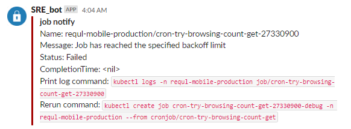

# k8s-job-notifier

kubernetes jobの終了ステータス時にSlackへ通知するためのアプリケーション。

とにかく最小限の機能だけ実装しています。

inspired by [bitnami-labs/kubewatch](https://github.com/bitnami-labs/kubewatch)


## Example



- - -

# Installation

See: [Installation](./docs/setup.md)

# Usage

CronJob, Jobマニフェストのアノテーションで通知設定を行う。

具体的には `spec.jobTemplate.metadata.annotations` に所定のkey/valueを記述する。

### 実際の設定例

この設定例では以下のような設定で通知を行います。

- ジョブの失敗時にslack通知を行う。
- `#times_sre` channelに対してメッセージを送信する。

```example.yaml
apiVersion: batch/v1beta1
kind: CronJob
metadata:
  name: hello
spec:
  schedule: "*/1 * * * *"
  jobTemplate:
    metadata:
      annotations:
        notify-slack.finc.com/enabled : "true"
        notify-slack.finc.com/channel: "#times_sre"
        notify-slack.finc.com/conditions: "Failed"
    spec:
      template:
        spec:
          containers:
          - name: hello
            image: busybox
            command: ["echo", "hello"]
```

## notify-slack annotations

annotation prefix `notify-slack.finc.com` に設定できる設定一覧。

設定を行わなかった場合、デフォルト設定が適用されます。デフォルト設定は環境変数によって上書きすることが可能です。

e.g. `notify-slack.finc.com/channel: "#times_sre"`

| Key | Description | Example value | Default | Environment variable |
| ------------- | ------------- | ------------- | ------------- | ------------- |
| **enabled**| Jobリソースのslack通知を有効化します。 | `true` | true |SLACK_DEFAULT_ENABLED  |
| **channel**| 通知先チャンネルを指定します | `#times_sre` | production: `#job-notify` staging: `#job-notify-stg` | DEFAULT_CHANNEL|
| **conditions**| 通知するジョブコンディションを `,` 区切りで指定します。| `Complete, Failed` | `Failed` ||

## 制限事項

基本スケールしません。

replica=1で動かす前提で、eventの厳密なqueue管理を行っていないので二重起動すると二重に通知が送信されます。

